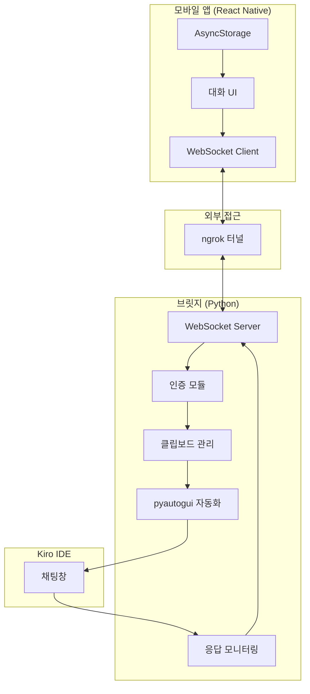

# OKXUS 설계 문서

## Overview

OKXUS(OneHundred Kiro nexUS)는 모바일 앱에서 집 PC의 Kiro IDE와 원격으로 대화할 수 있는 시스템입니다. 시스템은 세 가지 주요 컴포넌트로 구성됩니다:

1. **Bridge (Python)**: 집 PC에서 실행되는 WebSocket 서버로, 모바일 앱과 Kiro IDE 사이의 메시지를 중계
2. **Mobile App (React Native)**: 사용자의 모바일 기기에서 실행되는 대화 UI 애플리케이션
3. **Kiro IDE**: 집 PC에서 실행 중인 IDE (pyautogui를 통해 제어)

```
┌─────────────────┐     WebSocket      ┌─────────────────┐     pyautogui     ┌─────────────────┐
│   Mobile App    │◄──────────────────►│     Bridge      │◄─────────────────►│    Kiro IDE     │
│  (React Native) │     (ngrok)        │    (Python)     │   (클립보드/키입력)  │                 │
└─────────────────┘                    └─────────────────┘                    └─────────────────┘
```

### 핵심 데이터 흐름

1. **메시지 전송 (모바일 → Kiro)**:
   - Mobile App → WebSocket → Bridge → 클립보드 복사 → pyautogui로 Ctrl+V, Enter → Kiro IDE

2. **응답 수신 (Kiro → 모바일)**:
   - Kiro IDE 응답 → Bridge가 화면 모니터링 → 응답 텍스트 추출 → WebSocket → Mobile App

## Architecture

### 시스템 아키텍처



### 컴포넌트 배치

| 컴포넌트 | 위치 | 기술 스택 |
|---------|------|----------|
| Mobile App | 사용자 모바일 기기 | React Native, TypeScript |
| Bridge | 집 PC | Python 3.x, websockets, pyautogui, pyperclip |
| ngrok | 집 PC | ngrok CLI |
| Kiro IDE | 집 PC | 기존 설치된 Kiro IDE |

## Components and Interfaces

### 1. Bridge 컴포넌트

#### WebSocket Server 모듈

```python
# bridge/server.py
class BridgeServer:
    """WebSocket 서버 - 모바일 앱과의 통신 담당"""
    
    async def start(self, host: str, port: int) -> None:
        """서버 시작"""
        
    async def handle_connection(self, websocket) -> None:
        """클라이언트 연결 처리"""
        
    async def broadcast(self, message: dict) -> None:
        """연결된 클라이언트에 메시지 전송"""
```

#### 인증 모듈

```python
# bridge/auth.py
class Authenticator:
    """토큰 기반 인증"""
    
    def __init__(self, token: str):
        """환경변수 또는 설정 파일에서 토큰 로드"""
        
    def validate(self, client_token: str) -> bool:
        """클라이언트 토큰 검증"""
```

#### 자동화 모듈

```python
# bridge/automation.py
class KiroAutomation:
    """pyautogui를 사용한 Kiro IDE 제어"""
    
    def activate_kiro_window(self) -> bool:
        """Kiro IDE 창 활성화"""
        
    def send_message(self, message: str) -> bool:
        """클립보드 복사 후 붙여넣기 및 Enter"""
        
    def is_kiro_running(self) -> bool:
        """Kiro IDE 실행 상태 확인"""
```

#### 응답 모니터링 모듈

```python
# bridge/monitor.py
class ResponseMonitor:
    """Kiro IDE 응답 모니터링"""
    
    async def wait_for_response(self, timeout: int = 60) -> str:
        """응답 완료까지 대기 후 텍스트 반환"""
        
    def is_responding(self) -> bool:
        """현재 응답 생성 중인지 확인"""
```

### 2. Mobile App 컴포넌트

#### WebSocket 서비스

```typescript
// src/services/websocket.ts
interface WebSocketService {
  connect(url: string, token: string): Promise<void>;
  disconnect(): void;
  sendMessage(message: string): Promise<void>;
  onMessage(callback: (message: Message) => void): void;
  onStatusChange(callback: (status: ConnectionStatus) => void): void;
}
```

#### 메시지 타입

```typescript
// src/types/message.ts
interface Message {
  id: string;
  content: string;
  sender: 'user' | 'kiro';
  timestamp: Date;
  status: 'sending' | 'sent' | 'error';
}

type ConnectionStatus = 'connected' | 'connecting' | 'disconnected' | 'error';
```

#### UI 컴포넌트

```typescript
// src/components/ChatScreen.tsx
// 메인 대화 화면 - Kiro IDE 스타일 (블랙 배경 + 네온 컬러)

// src/components/MessageBubble.tsx
// 메시지 버블 - 사용자(네온 핑크), Kiro(네온 그린)

// src/components/InputBar.tsx
// 하단 고정 입력창 + 전송 버튼

// src/components/ConnectionStatus.tsx
// 연결 상태 표시
```

### 3. 통신 프로토콜

#### WebSocket 메시지 포맷

```typescript
// 클라이언트 → 서버
interface ClientMessage {
  type: 'auth' | 'message' | 'status_request' | 'heartbeat';
  payload: {
    token?: string;      // auth 시
    content?: string;    // message 시
  };
  timestamp: number;
}

// 서버 → 클라이언트
interface ServerMessage {
  type: 'auth_result' | 'message_ack' | 'kiro_response' | 'status' | 'error' | 'heartbeat';
  payload: {
    success?: boolean;
    content?: string;
    status?: BridgeStatus;
    error?: string;
  };
  timestamp: number;
}

interface BridgeStatus {
  kiro_running: boolean;
  connected_clients: number;
  uptime: number;
}
```

## Data Models

### Bridge 데이터 모델

```python
# bridge/models.py
from dataclasses import dataclass
from enum import Enum
from datetime import datetime

class MessageType(Enum):
    AUTH = "auth"
    MESSAGE = "message"
    STATUS_REQUEST = "status_request"
    HEARTBEAT = "heartbeat"

class ResponseType(Enum):
    AUTH_RESULT = "auth_result"
    MESSAGE_ACK = "message_ack"
    KIRO_RESPONSE = "kiro_response"
    STATUS = "status"
    ERROR = "error"
    HEARTBEAT = "heartbeat"

@dataclass
class ClientMessage:
    type: MessageType
    payload: dict
    timestamp: float

@dataclass
class ServerMessage:
    type: ResponseType
    payload: dict
    timestamp: float

@dataclass
class BridgeStatus:
    kiro_running: bool
    connected_clients: int
    uptime: float
```

### Mobile App 데이터 모델

```typescript
// src/types/index.ts

// 메시지 모델
interface Message {
  id: string;
  content: string;
  sender: 'user' | 'kiro';
  timestamp: Date;
  status: MessageStatus;
}

type MessageStatus = 'sending' | 'sent' | 'delivered' | 'error';

// 연결 상태
type ConnectionStatus = 'connected' | 'connecting' | 'disconnected' | 'reconnecting' | 'error';

// 앱 설정
interface AppConfig {
  bridgeUrl: string;
  authToken: string;
  reconnectAttempts: number;
  heartbeatInterval: number;
}

// 대화 세션
interface ChatSession {
  messages: Message[];
  connectionStatus: ConnectionStatus;
  isKiroResponding: boolean;
}
```

### 저장소 스키마

```typescript
// AsyncStorage 키
const STORAGE_KEYS = {
  AUTH_TOKEN: '@okxus/auth_token',
  BRIDGE_URL: '@okxus/bridge_url',
  CHAT_HISTORY: '@okxus/chat_history',
  SETTINGS: '@okxus/settings',
};
```


## Correctness Properties

*속성(Property)은 시스템의 모든 유효한 실행에서 참이어야 하는 특성 또는 동작입니다. 속성은 사람이 읽을 수 있는 명세와 기계가 검증할 수 있는 정확성 보장 사이의 다리 역할을 합니다.*

### Property 1: 클립보드 복사 라운드트립

*For any* 유효한 메시지 문자열에 대해, Bridge가 클립보드에 복사한 후 클립보드에서 읽은 값은 원본 메시지와 동일해야 한다.

**Validates: Requirements 2.2**

### Property 2: 토큰 인증 정확성

*For any* 인증 토큰에 대해, 유효한 토큰은 연결을 허용하고 무효한 토큰은 연결을 거부해야 한다. 즉, `validate(token) == (token == valid_token)`이어야 한다.

**Validates: Requirements 6.1, 6.2**

### Property 3: 메시지 시간순 정렬

*For any* 메시지 목록에 대해, UI에 표시되는 메시지는 항상 timestamp 기준 오름차순으로 정렬되어야 한다.

**Validates: Requirements 4.2**

### Property 4: 메시지 sender 구분 렌더링

*For any* 메시지에 대해, sender가 'user'이면 네온 핑크(#ff6ec7) 스타일로, sender가 'kiro'이면 네온 그린(#39ff14) 스타일로 렌더링되어야 한다.

**Validates: Requirements 4.1**

### Property 5: 상태 요청 응답 형식

*For any* 상태 요청에 대해, Bridge는 `kiro_running`, `connected_clients`, `uptime` 필드를 포함하는 유효한 BridgeStatus 객체를 반환해야 한다.

**Validates: Requirements 5.3**

### Property 6: 연결 끊김 시 재연결 시도

*For any* 활성 연결 상태에서 연결이 끊어지면, Mobile App은 자동으로 재연결을 시도해야 한다. 연결 상태는 'disconnected'에서 'reconnecting'으로 전이되어야 한다.

**Validates: Requirements 1.3**

### Property 7: 로딩 상태 인디케이터 표시

*For any* 앱 상태에서 `isKiroResponding`이 true이면, UI는 로딩 인디케이터를 표시해야 한다.

**Validates: Requirements 4.4**

### Property 8: Kiro 미실행 상태 감지

*For any* 상태 확인 시점에서 Kiro IDE 프로세스가 실행 중이 아니면, Bridge는 `kiro_running: false` 상태를 반환해야 한다.

**Validates: Requirements 5.4**

### Property 9: 오류 발생 시 오류 메시지 전송

*For any* Bridge 작업 중 오류가 발생하면, Bridge는 `type: 'error'`와 오류 설명을 포함하는 ServerMessage를 Mobile App에 전송해야 한다.

**Validates: Requirements 3.4**

### Property 10: WebSocket 메시지 전송 확인

*For any* 유효한 메시지 전송 요청에 대해, Bridge는 메시지 처리 완료 후 `type: 'message_ack'`와 `success: true`를 포함하는 응답을 반환해야 한다.

**Validates: Requirements 2.4**

## Error Handling

### Bridge 오류 처리

| 오류 상황 | 처리 방법 | 클라이언트 응답 |
|----------|----------|----------------|
| WebSocket 연결 실패 | 로그 기록, 재시도 대기 | N/A |
| 인증 실패 | 연결 종료 | `{type: 'error', payload: {error: 'Invalid token'}}` |
| Kiro IDE 미실행 | 상태 업데이트 | `{type: 'status', payload: {kiro_running: false}}` |
| 클립보드 복사 실패 | 재시도 (최대 3회) | `{type: 'error', payload: {error: 'Clipboard error'}}` |
| 창 활성화 실패 | 로그 기록, 오류 반환 | `{type: 'error', payload: {error: 'Window activation failed'}}` |
| 응답 읽기 실패 | 타임아웃 후 오류 반환 | `{type: 'error', payload: {error: 'Response read timeout'}}` |

### Mobile App 오류 처리

| 오류 상황 | 처리 방법 | 사용자 피드백 |
|----------|----------|--------------|
| 연결 실패 | 자동 재연결 (최대 3회) | 연결 상태 표시 변경 |
| 재연결 3회 실패 | 수동 재연결 대기 | "연결 실패" 알림 표시 |
| 메시지 전송 실패 | 메시지 상태 'error'로 변경 | 재전송 버튼 표시 |
| 인증 오류 | 토큰 재입력 요청 | 설정 화면으로 이동 |
| 네트워크 오류 | 오프라인 모드 전환 | "오프라인" 상태 표시 |

### 오류 메시지 포맷

```typescript
interface ErrorResponse {
  type: 'error';
  payload: {
    error: string;
    code?: ErrorCode;
    details?: string;
  };
  timestamp: number;
}

enum ErrorCode {
  AUTH_FAILED = 'AUTH_FAILED',
  KIRO_NOT_RUNNING = 'KIRO_NOT_RUNNING',
  CLIPBOARD_ERROR = 'CLIPBOARD_ERROR',
  WINDOW_ERROR = 'WINDOW_ERROR',
  TIMEOUT = 'TIMEOUT',
  UNKNOWN = 'UNKNOWN',
}
```

## Testing Strategy

### 테스트 접근 방식

이 프로젝트는 **단위 테스트**와 **속성 기반 테스트(Property-Based Testing)**를 병행합니다.

- **단위 테스트**: 특정 예시, 엣지 케이스, 오류 조건 검증
- **속성 기반 테스트**: 모든 입력에 대해 보편적 속성 검증

### 속성 기반 테스트 설정

**Python (Bridge)**: `hypothesis` 라이브러리 사용
```python
# 최소 100회 반복 설정
from hypothesis import settings, given
from hypothesis.strategies import text, integers

@settings(max_examples=100)
@given(message=text(min_size=1))
def test_clipboard_roundtrip(message):
    # Feature: okxus, Property 1: 클립보드 복사 라운드트립
    ...
```

**TypeScript (Mobile App)**: `fast-check` 라이브러리 사용
```typescript
// 최소 100회 반복 설정
import fc from 'fast-check';

test('messages are sorted by timestamp', () => {
  // Feature: okxus, Property 3: 메시지 시간순 정렬
  fc.assert(
    fc.property(fc.array(fc.record({...})), (messages) => {
      // 검증 로직
    }),
    { numRuns: 100 }
  );
});
```

### 테스트 매트릭스

| 속성 | 테스트 유형 | 라이브러리 | 대상 컴포넌트 |
|-----|-----------|-----------|-------------|
| Property 1 | 속성 기반 | hypothesis | Bridge |
| Property 2 | 속성 기반 | hypothesis | Bridge |
| Property 3 | 속성 기반 | fast-check | Mobile App |
| Property 4 | 속성 기반 | fast-check | Mobile App |
| Property 5 | 속성 기반 | hypothesis | Bridge |
| Property 6 | 단위 테스트 | jest | Mobile App |
| Property 7 | 속성 기반 | fast-check | Mobile App |
| Property 8 | 단위 테스트 | pytest | Bridge |
| Property 9 | 속성 기반 | hypothesis | Bridge |
| Property 10 | 속성 기반 | hypothesis | Bridge |

### 단위 테스트 범위

**Bridge (pytest)**:
- 서버 시작/종료
- 연결 핸들링
- 인증 흐름
- Kiro IDE 프로세스 감지

**Mobile App (jest + React Native Testing Library)**:
- 컴포넌트 렌더링
- WebSocket 연결 상태 전이
- 재연결 로직 (3회 실패 시나리오)
- AsyncStorage 저장/로드

### 통합 테스트

- 전체 메시지 전송 파이프라인 (Mobile → Bridge → Kiro)
- 응답 수신 파이프라인 (Kiro → Bridge → Mobile)
- ngrok 터널을 통한 외부 연결

